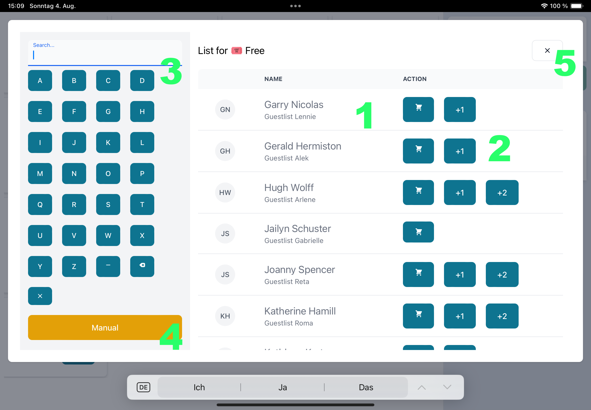

# Kasseapparat: User Documentation

Kasseapparat is a point of sale and guestlist system for demoparties. It is heavily inspired by Partymeister.

It is separated in a [POS](#pos) and an [admin](#admin) part.

You will need the same credentials for both parts.

## Credentials

You may log in with either your username or your email address. Both pieces of information can be found in the initial email you received.

### Initial login

You should have received an email with a link guiding you to the change password dialogue.

Click on this link and choose a password with more than 8 characters. Using a password manager is a good thing!

After that you are redirected to the login dialogue.

If your password reset token has expired, request a new password by following the 'Forgot password' steps.

### Forgot your password

In case you forgot your password: click on "Forgot password" below the login dialogue.

Enter your email or username and you will receive an email within seconds.

Click on this link and choose a password with more than 8 characters. Using a password manager is a good practice!

After that, you are redirected to the login dialogue.

If you do not receive an email:

- the username or email does not exist
- you already have a password validation process running (you will have to wait for some time)
- the mail is in your spam folder
- some problem occurred (e.g. sending the mail was not successful)

## <a name="pos">POS</a>

The interface consists of four main parts:

- the product list on the left (1)
- the current cart on top right (2)
- the last purchases on lower right (3)
- a small navigation, containing the currently logged in username, a logout button and a link to the [admin](#admin) (4)

### Product List

_Products with a shopping cart button_ can be added to the cart directly. For each click on the button one more quantity of the selected product is added to the cart.

_Products with a list_ will open an additional window, where you can find a list of persons (1). Once you click on the buttons (2) associated with the users this will be added to the cart (+1 means "plus an additional person" and so on).

On the left side of the window you may search for these people (3). The Buttons contain letters A to Z, spaces (\_), delete the last character (<X) and delete the whole searchterm (x).

In very rare circumstances you may add a manual entry (without a selected person) using the yellow "manual" button (4).

Closing the window works by clicking outside the window or by clicking the close button (5).

Neither the products nor the guestlist can be modified using the pos interface. This needs to be done in the [admin](#admin),

### Cart

The cart shows what the current customer has ordered.

You may delete the whole cart or remove a certain product from the cart. It is not possible to reduce the amount of a certain product (to reduce simplicity). This action is performed without confirmation.

When the order is complete and the user has paid press "checkout" (no confirmation again). Afterwards the cart is empty again and the purchase is shown under the "last purchases" below.

### Last Purchases

Shows the minimal information (date, total value of purchase) on last purchases.

This allows to revert a previous purchase. Simply click on the button and confirm the dialogue.

To revert previous purchases use the admin, please.

## <a name="admin">Admin</a>

The admin interface is needed to modify the products, manage the users and modify the guestlists. You will need the same credentials as for the POS.

The Interface consists of several areas:

- The menu (1) where you can select the entity to modify
- The action bar (2) to create an entity. Might contain tools to search or filter the entities.
- The list of entities (3) with some basic information. Once you click on an entity, you will see details or an option to modify it
- A pagination bar (4)

### Add product

To create a product click on "POS > Products" in the menu, then "+ Create" in the action bar.

You will have to fill out some fields:

- Name
- Price
- Pos (products will be ordered by this position in the POS, simply enter a value that is between the product that should be before and the product that should be after your product)
- Wrap After (set this to true and the next product will be shown on a new line in the POS)
- Hidden (set this to true and your product will not be shown)
- API export (should be true for visitor, false for merchandise and co. all those with value true will count towards the number of visitors)

Save.

You will need to reload the POS to show your product.

### Disable a product

Big warning sign here: you probably do _not_ want to delete a product once the initial setup was done.

When you run out of stock and do not want to a product to be shown in the POS, simply disable it. This can be reverted anytime.

Simply click on the product you would like to disable, click on the "Hidden" toggle and Save.

Done.

You will need to reload the POS to see the effect.

### Delete purchases

When you need to delete an older purchase -- for whatever reason -- you may use the admin.

Click on "POS > Purchases".

Purchases are ordered by the checkout time. In addition you should see the cart's value and the user that performed the action.

Clicking on the purchase gives some more details.

Once you are really sure, simply click on "Delete" and confirm.

### Add user

Click on "Admin > Users". And "+ Create" in the action bar.

Enter the following information:

- Username
- Email address
- Admin (only available when you are an admin yourself)

Save.

The user will receive an email with a password reset link.

### Add a user to the guestlist

This is probably a two step process, as the list entries are organized in separate guest lists.

#### Create the guestlist

(In case you already added a guestlist or would like to add a person to an existing guestlist, you may skip this part)

Please, create a guestlist for you. It is recommended to follow a naming scheme such as "Guestlist [yourname]".

Click on "Guestlist > Lists". Click on "+ CREATE" in the action bar.

Enter the following information:

- Name (something like "Guestlist [yourname]")
- Type code (probably false, true when the list contains barcodes)
- Product (probably "Free", the associated product)

Save.

#### Add the user to your guestlist

Click on "Guestlist > List Entries". Click on "+ CREATE" in the action bar.

Enter the following information:

- List (the one from the previous step)
- Name (real name of the person)
- Code (leave empty)
- Additional guests (number of additional guests the person is allowed to bring)
- Arrival Note (This message will be presented in the POS, when the user is selected. It is intended for information like "Will receive a Shirt". Refrain from adding funny stuff here.)
- Notify Email (Add your email address here, in case you would like to be informed once the person arrives)

Save.
